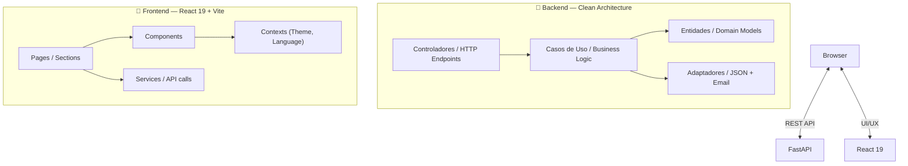

# 🏛️ Graphite & Bronze: Full-Stack Engineering Portfolio

[](LICENSE)
[](https://github.com/Argenis1412/portfolio/actions)
[](https://github.com/Argenis1412/portfolio/actions)
[](https://www.python.org/downloads/)
[](https://react.dev/)

> **A personal portfolio built as a full-stack engineering project — featuring a FastAPI (Python) backend and a React 19 (TypeScript) frontend, organized with Clean Architecture and a refined "Graphite & Bronze" aesthetic.**

The goal of this project is not only to showcase my work, but also to demonstrate how I think and build software: with clean structure, automated tests, and attention to the user experience. 

The system is architected as a **decoupled client-server ecosystem**:
- **Backend**: Serves all portfolio data through a versioned REST API.
- **Frontend**: Acts as a **strict consumer** of the API, demonstrating production-ready integration patterns, CORS compliance, and clear separation of concerns.

---

## 🛠️ Tech Stack & Key Features

| Layer | Technology |
|---|---|
| **Backend** | FastAPI · Pydantic V2 · structlog · slowapi |
| **Frontend** | React 19 · TypeScript · Vite · TanStack Query · Tailwind CSS v4 · Framer Motion · Lucide |

| **Testing** | Pytest (backend) · Vitest + Testing Library (frontend) |
| **CI/CD** | GitHub Actions (Lint + Test + **Docker Build** on every push) |
| **Data** | SQLite with **SQLModel** & **Alembic** migrations |
| **Deployment** | Koyeb (Backend via Dockerfile) · Vercel (Frontend) |

- **💎 Architecture**: Clean Architecture on backend; React Query for declarative data fetching and globally managed state on frontend.
- **🌍 Scalable i18n**: Multilingual support (PT, EN, ES) with externalized JSON manifests for zero-recompile maintenance.
- **⚡ High-Performance UX**:
    - **Predictive Prefetching**: Data is pre-loaded on link hover, making transitions instant.
    - **Background Sync**: Data stays fresh silently without manual refresh.
    - **Optimized Assets**: Lazy loading + LCP prioritization.
- **🛡️ Multi-Layer Protection**: Honeypots, rate limiting, and **30-minute persistent deduplication** protect the contact form.
- **🏗️ Developer Experience**: Husky + Lint-Staged + Vitest + GitHub Actions enforce a "no broken code" policy.

---

## 🚀 Step-by-Step Installation

### 1. Clone the Repository
```bash
git clone https://github.com/Argenis1412/portfolio.git
cd portfolio
```

### 2. Universal Quick Start (Makefile)
You can run the application servers and tests on any OS stringing `make` targets from the project root.
*(Make sure to have your Python `.venv` active before running backend targets).*

```bash
# Terminal 1: Start the Backend (FastAPI)
make dev-back

# Terminal 2: Start the Frontend (Vite)
make dev-front
```

### 3. Manual Installation (Backend)
The backend uses a SQLite database populated via Alembic migrations and SQLModel for both static portfolio data and transactional state (contact form deduplication, rate limiting logs).
```bash
cd backend

# Create virtual environment
# Windows:
py -3.12 -m venv .venv
# Linux/macOS:
python -m venv .venv

# Activate virtual environment
# Windows:
.venv\Scripts\activate
# Linux/macOS:
source .venv/bin/activate

# Install dependencies
pip install -r requirements.txt

# (Optional) Configure environment variables
# Windows:
copy .env.example .env
# Linux/macOS:
cp .env.example .env
# Edit .env to set FORMSPREE_FORM_ID for contact form

# Start the server
python -m uvicorn app.principal:app --reload --port 8000
```
- API: `http://localhost:8000`
- Interactive Docs (Swagger): `http://localhost:8000/docs`
- **Produção (Docs)**: `https://selected-fionna-argenis1412-58caae17.koyeb.app/docs`

### 4. Configure the Frontend (React)
```bash
cd frontend
npm install
npm run dev
```
- Frontend: `http://localhost:5173`

> The frontend reads `VITE_API_URL` from the environment. In development it defaults to `http://127.0.0.1:8000/api/v1`.

### 🐳 Using Docker (Optional)
Run the entire stack with a single command:
```bash
docker-compose up --build
```

---

## 🧪 Running Tests

### Universal Quick Tests
You can run all tests quickly using the `Makefile` from the root directory:
```bash
make test        # Runs both backend and frontend tests
make test-back   # Runs only backend tests (requires active .venv)
make test-front  # Runs only frontend tests
```

### Backend Manual Tests
```bash
cd backend
# Standard (with venv active)
pytest

# With coverage report
pytest --cov=app --cov-report=html
```

The backend suite now includes automated checks for the contact anti-spam flow, including honeypot silent drops and suspicious/spam score classification.

### Frontend
```bash
cd frontend
# Run tests once
npm run test

# Or in watch mode
npx vitest
```
The frontend uses **Vitest** + **@testing-library/react** with a `jsdom` environment. Tests live in `src/tests/`.

> Contact submissions include hidden honeypot inputs (`website` / `fax`) rendered off-screen so real users never interact with them, while basic bots are silently filtered.

---

## 💎 Engineering Highlights (The "Invisible" Engineering)

This project is built with industry-standard patterns to demonstrate production-ready engineering:

### 1. System Decoupling (Strict Consumer)
The frontend and backend are completely independent systems. The React application treats the FastAPI backend as a **black-box API**, interacting only via well-defined contracts. This architecture ensures:
- **Scalability**: Either layer can be scaled or rewritten (e.g., migrating to a different backend language) without affecting the other.
- **Security**: Strict CORS policies and payload validation at the boundary.
- **Clean Integration**: Using TanStack Query for declarative data fetching and state synchronization.

### 2. Advanced State Management & UX
We use **TanStack Query** not just for fetching, but for a "snappy" feels-like-native experience:
- **Zero-Latency Navigation**: We prefetch data when the user hovers over links. By the time they click, the data is already in cache.
- **Background Synchronization**: Data is refetched silently when the window is focused, ensuring you always see the latest information without a loading spinner.
- **Robust Mutations**: The contact form is managed via mutations, handling loading/success/error states declaratively.

### 3. Scalable Internationalization (i18n)
Instead of hardcoded strings, we use a **JSON-driven i18n strategy**. This allows non-developers to edit translations in `src/i18n/` without touching the component logic, following the same pattern used in large-scale enterprise apps.

### 4. Automated Quality Gate
- **Husky & lint-staged**: It's impossible to commit code that fails linting or tests. The project enforces quality at the source.
- **CI/CD quality gate**: Every push to GitHub triggers a full suite of backend and frontend tests via GitHub Actions. **The pipeline enforces a 80% test coverage threshold** — any code that lowers this metric is automatically rejected.
- **Dockerized Builds**: The system is automatically built and verified into Docker images during the CI process, ensuring "it works on my machine" translates perfectly to production.
- **Rate-Limiting & Anti-Spam**: Backend protection against brute-force and **30-minute message deduplication** (database-backed).

### 5. Future-Ready Architecture (Language Agnostic Core)
The backend follows **Clean Architecture** principles, isolating business logic (Use Cases) from infrastructure (Adapters). This design is inherently **language-agnostic**:
- **Framework Independence**: The core logic doesn't depend on FastAPI; it's pure Python.
- **Scalability Path**: This isolation makes it trivial to split the system into microservices or migrate performance-critical paths to languages like **Go** or **Rust** if needed, as the domain boundaries are already strictly defined.

---

## 🏗️ Architecture Layout




---

## 🗺️ Roadmap: The Next Big Step

Currently, this project demonstrates high-quality **Portfolio Management**. The next phase of evolution will focus on **Complex Business Logic**:

- **🚀 Transactional Core**: Implementing a high-integrity financial module (ledger system) with logic for payments, interest calculation, and history tracking.
- **🔐 Advanced Auth**: Moving from stateless public data to protected user-specific dashboards with JWT/OAuth2.
- **📊 Real-time Analytics**: Integration with WebSockets for live portfolio views.

This roadmap demonstrates the vision to evolve from a static showcase to a **mission-critical transactional system**.

---

---

## 📁 Repository Structure
```
portfolio/
├── backend/          # FastAPI backend (Clean Architecture)
├── frontend/         # React 19 + TypeScript frontend
├── .github/          # GitHub Actions CI/CD workflows
├── infra/
│   └── alternatives/ # Deployment configs for Railway/Render
│       ├── railway.toml
│       └── render.yaml
└── docker-compose.yml
```

For detailed information about each part, see:
- [`backend/README.md`](backend/README.md)
- [`frontend/README.md`](frontend/README.md)

---

## 👨‍💻 Author

**Argenis Lopez** — Backend Developer

- 💼 [LinkedIn](https://www.linkedin.com/in/argenis1412/)
- 🐙 [GitHub](https://github.com/Argenis1412)

---

This project is licensed under the **MIT License** — see the [LICENSE](LICENSE) file for details.
